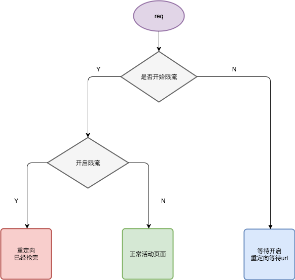

# rate2

> express/koa 限流器



## Install

```
$ npm i -S rate2
```

## Usages

express

```
const express = require('express')
const app = express();

var rate = require('rate2')(require('./config'))

var i = 0

app.get('/', rate.express, function (req, res) {
    i++
    res.json({ count: i });
});

app.listen(3000)
```

koa 2

```
const Koa = require('koa');
const app = new Koa();

var rate = require('.')(require('./config'))
var i = 0
app.use(rate.koa)

app.use(function (ctx, next) {
    i++
    console.log({ count: i })
    return ctx.body = { count: i };
});

app.listen(3000)
```

## 配置项

```
{
    "key": "rate_list7",
    "count": 10,
    "conn": [
      {
        "port": 6379,
        "host": "127.0.0.1",
        "family": 4,
        "password": "",
        "db": 0
      },
      {
        "port": 6378,
        "host": "127.0.0.1",
        "family": 4,
        "password": "",
        "db": 0
      }
    ],
    "redirect_url": "https://www.baidu.com/"
  }
```

## Api

- 初始化参数是json配置项

```
var rate = require('rate2')(require('./config'))
```

- 开启限流

```
rate.enable()
```

- 关闭限流

```
rate.disable('https://cnodejs.org/')
```

- 制造数据

```
rate.makeData()
```

- express中间件

```
app.get('/', rate.middleware, function (req, res) {
    i++
    res.json({ count: i });
});
```

## 测试

1）准备

```
redis-server --port 6378
redis-server --port 6379
```

2）增加redis里的数据

默认按照当前目录的config.js，向2台redis服务器里增加10条数据，每个服务器5条

```
$ npm run disable 
$ npm run enable
$ npm run data
```

3）启动express服务器

```
$ node app
```

此时访问 http://127.0.0.1:3000 地址，头10次是正常访问，之后的都会被重定向。

## redis基础操作

```
var Redis = require('ioredis');

var redis = new Redis();

// redis.lpush('list', [1,2,3,4,5,6])

// redis.lrange('list', 0 , 100)

// redis.blpop('list', 100).then(function(a){
//     console.log(a)
// })

redis.mset('enable',1, 'url','https://cnodejs.org/')


redis.mget('enable','url').then(function(a) {
    console.log(a)
})

```

## TODO

如果需要，可以使用msgpack5序列化，来存储config，效果更好

## Contributing

1. Fork it
2. Create your feature branch (`git checkout -b my-new-feature`)
3. Commit your changes (`git commit -am 'Add some feature'`)
4. Push to the branch (`git push origin my-new-feature`)
5. Create new Pull Request

## 版本历史

- v1.0.0 初始化版本cli

## 欢迎fork和反馈

- write by `i5ting` i5ting@126.com

如有建议或意见，请在issue提问或邮件

## License

this repo is released under the [MIT
License](http://www.opensource.org/licenses/MIT).
